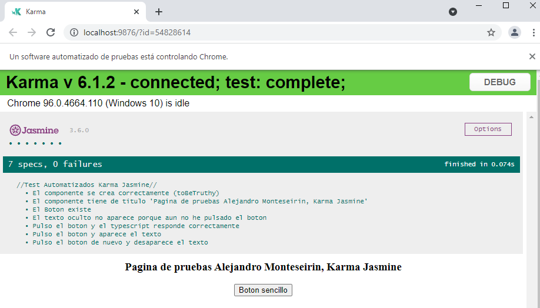

# Angular_Testing_Karma_Jasmine
Prototipo de una aplicación Angular con Test Automatizados utilizando Karma Jasmine.

### Pagina de prueba
Pagina de prueba sencilla, con un header que se obtiene del typescript y un boton que oculta o muestra un texto.

### Tests que realiza:
1. Comrpueba que el componente se inicializa correctamente
2. Comprueba que el valor del titulo es el adecuado directamente en el typescript
3. Comprueba que el boton existe
4. Comprueba que el texto oculto no se muestra
5. Pulsa el botón y comprueba que el typescript captura el cambio del modelo
6. Pulsa el botón y comprueba que el texto oculto **si** se muestra
7. Pulsa el botón dos veces y comprueba que ya no se muestra el texto

